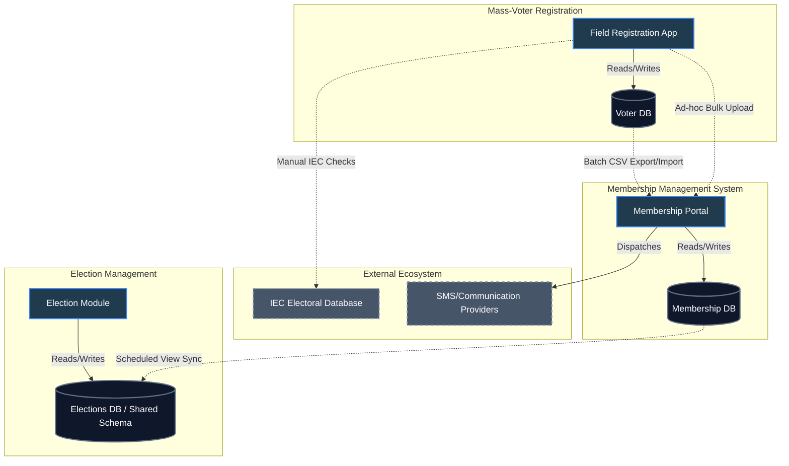
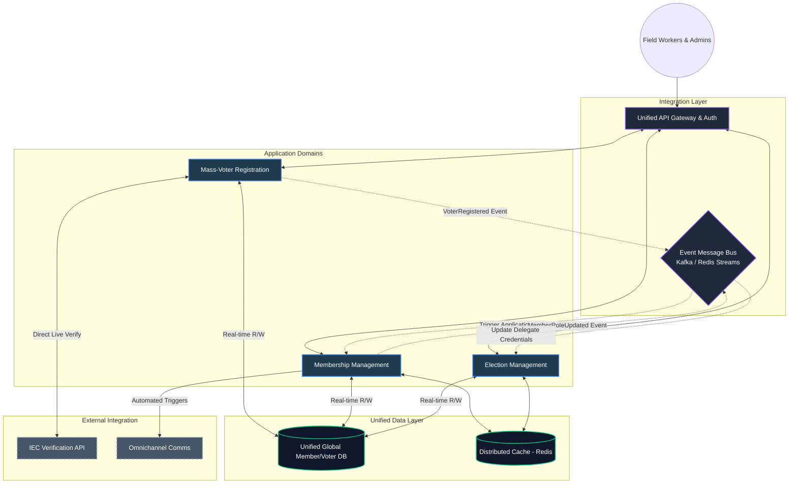

# Conceptual Architecture: Systems Integration
## Membership Management | mass-Voter Registration | Election Management

This document outlines the conceptual architecture representing the integration between the three core pillars of the organization's administration systems. It defines the **Current State** (highlighting existing silos and batch processes) and proposes a robust **Future Data-Sharing Architecture** (focusing on real-time, event-driven data flow).

---

## 1. Core System Domains

1. **Membership Management System (MMS)**: The central source of truth for organizational hierarchy, member profiles, roles, and administrative communication.
2. **Mass-Voter Registration (MVR)**: The field operations module dedicated to capturing unregistered citizens, interfacing with Electoral Commission (IEC) verification, and funneling supporters into the organization.
3. **Election Management (EM)**: The system handling internal structural elections, delegate accreditation, voting operations, and leadership transition tracking.

---

## 2. Current Integration Architecture

Currently, the systems operate with a degree of isolation. Integration is primarily handled through shared database views, manual bulk uploads (Excel/CSV), and scheduled batch jobs rather than real-time synchronous APIs.

### Current State Diagram

### Current Pain Points
- **Data Latency**: Because integration relies on CSV bulk uploads or slow DB view syncs, a voter registered in the morning might not appear in the membership system until the next day.
- **Data Duplication**: Voters and Members are essentially the same people, but their records might be duplicated across `Voter DB` and `Membership DB`.
- **Accreditation Risks**: Sourcing delegates for the Election Management system directly from out-of-date views can lead to credential issues on election day.

---

## 3. Future Data-Sharing Architecture (Target State)

The future architecture shifts towards an **Event-Driven Microservices** model or a **Unified API Gateway** approach. This ensures that a single source of truth is maintained, data is shared dynamically, and changes trigger immediate programmatic updates across all domains.

### Future State Diagram

---

## 4. Key Future Integration Workflows

### A. Seamless Voter-to-Member Pipeline
1. **Capture**: A field agent registers a citizen in the **Mass-Voter Registration (MVR)** app.
2. **Verify**: MVR immediately calls the **IEC API** to verify voting district and ID validity.
3. **Event Publish**: Upon successful registration, MVR publishes a `VoterRegistered` event to the **Message Bus**.
4. **Member Creation**: The **Membership Management System (MMS)** consumes this event, automatically opening a draft membership application and sending a welcome WhatsApp/SMS via the **Communications API** asking them to complete their profile.

### B. Dynamic Election Accreditation
1. **Election Scheduled**: An election is scheduled in the **Election Management (EM)** module.
2. **Credential Sync**: EM subscribes to the `MembershipStatusChanged` and `LeadershipAssigned` events on the **Message Bus**. 
3. **Real-time Roster**: As members renew their subscriptions or get appointed to ward leadership within **MMS**, **EM** dynamically updates their accreditation status for the upcoming election without requiring manual Excel exports.
4. **Voting**: On election day, the **Unified Data Layer** guarantees that the member checking in has exactly the same data as their verified voter profile.

---

## 5. Technology Enablers Required

To transition from the current state to the future state, the following implementation steps are recommended:

1. **Unified API Gateway**: Implement a single routing layer (like Kong or Nginx) to handle Authentication centrally so a user logged into Membership can seamlessly access Election Management.
2. **Event Pub/Sub implementation**: Leverage the existing **Redis** infrastructure to implement Redis Streams (or introduce RabbitMQ/Kafka) to broadcast domain events instead of tightly coupling code.
3. **Shared Source of Truth**: Consolidate `Voter` and `Member` entities in PostgreSQL. Separate the *roles* (Is_Voter vs Is_Member) rather than separating the *people* into different databases or isolated tables. 
4. **IEC API Direct Integration**: Replace manual IEC checks with real-time REST API queries during the registration flow to ensure instant geographic alignment.
